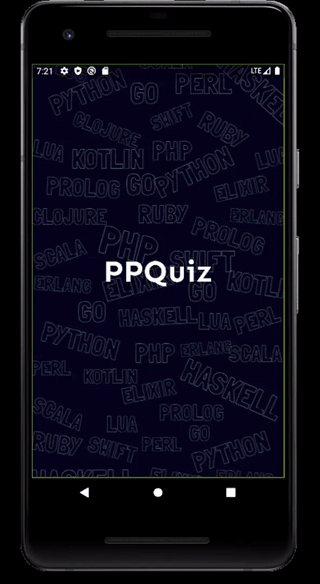
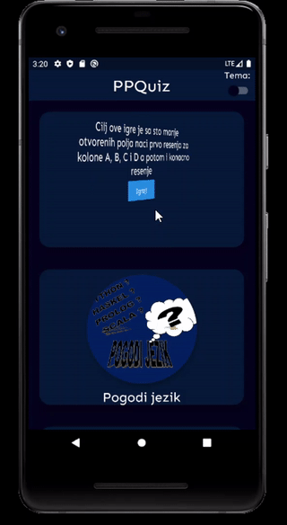
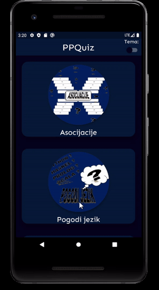
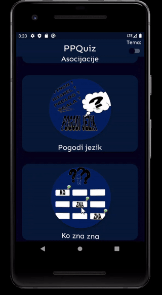

# 2020_PPQuiz

## :memo: Opis
Kviz aplikacija namenjena android mobilnim uredjajima. Kviz sadrzi tri igre koje sluze za zabavu, ali i da olaksaju studentima ucenje o programskim paradigmama i da im pomognu da provere steceno znanje. Aplikacija se moze pokretati u dark\light mode-u.

## :video_game: Asocijacije
Cilj ove igre je sa sto manje otvorenih polja naci prvo resenja za kolone A, B, C i D a potom i konacno resenje.

## :video_game: Pogodi Jezik
Cilj ove igre je otvaranjem datih osobina pogoditi o kom programskom jeziku je rec.

## :video_game: Ko Zna Zna
Cilj ove igre je odgovoriti na 10 postavljenih pitanja. Za svako od njih ponudjena su 4 odgovora. Ukoliko tacno odgovorite na pitanje dobijate 5 poena, ukoliko pogresite -1 poen, a ukoliko ne odgovorite u roku od 10sekundi 0 poena.

## :bar_chart: Jezici i tehnologije
Korišćen je programski jezik Dart i framework Flutter u Android Studio okruženju.

## :wrench: Pokretanje
Aplikacija jej podržana za Android. Da bi se pokrenula na racunaru potrebno je imati Android Studio, Dart i Flutter sdk. Mozemo je pomocu aplikacije Vysor instalirati na mobilni uredjaj sa Android operativnim sistemom i nakon toga preko mobilnog uredjaja pokretati je kao i sve ostale aplikacije. 

## :computer: Autori

Maja Crnomarkovic 21/2017 majacrnomarkovic@live.com

Marko Babic 77/2017 markobabic056@gmail.com

Aleksandar Milosevic 60/2017 aleksandarmilosevic98@gmail.com
